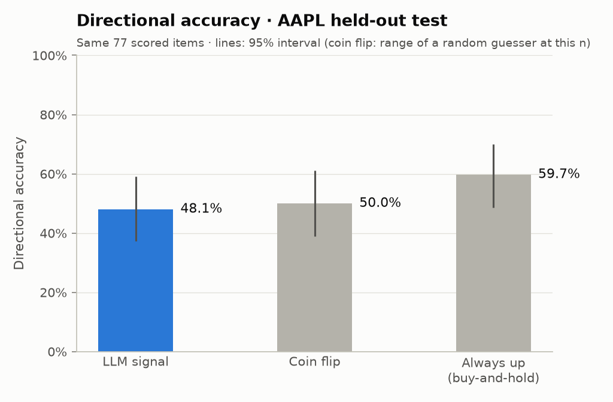
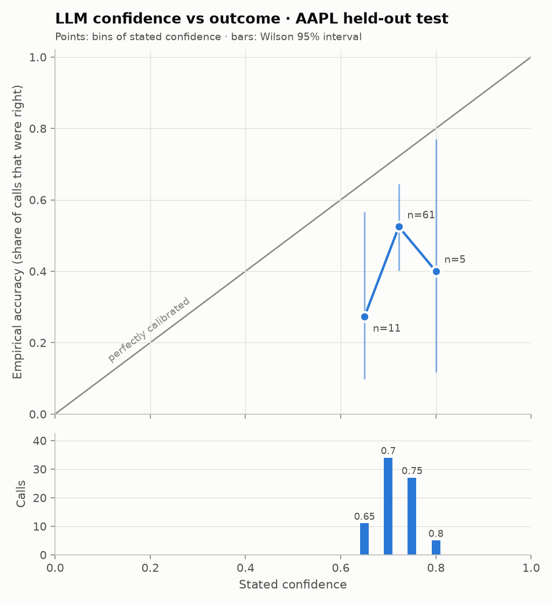

# LLM Signal Confidence & Calibration

A small, honest research prototype. It asks an LLM (`gpt-4o-mini-2024-07-18`) to read one financial news
headline about Apple and return a next-day direction (bullish / bearish / neutral) with a self-reported
confidence. It then tests whether that confidence can be believed. **This is not a trading strategy.**
There is no P&L, no transaction costs and no execution. It is a demonstration of evaluation discipline on
a deliberately small sample: 150 headlines, one ticker, one year. The evaluation harness is the
deliverable. A harness that shows a model's confidence is *not* trustworthy has done its job.

## Headline result

**On 77 scored held-out headlines, the LLM called the next-day direction correctly 48.1% of the time
(95% CI 37–59%).** That is no better than a coin flip (50%, p = 0.82). It is also below simply assuming
the stock goes up, which was right 59.7% of the time on the same 77 items, though that gap is not
statistically significant either (exact McNemar p = 0.20). The 77 scored items are 73% of the 105 test
headlines; the other 28 were 22 "neutral" calls and 6 days whose move fell inside the dead-band.

<!-- RESULTS:START -->
| Metric | LLM signal | Baseline | Sample |
|---|---|---|---|
| Directional accuracy | **48.1%** (95% CI 37.3%–59.0%) | always-up 59.7% (95% CI 48.6%–70.0%); coin flip 50% (random 95% range 39.0%–61.0%) | n = 77 scored of 105 headlines (73.3% coverage) |
| Brier score (lower is better) | **0.300** (95% CI 0.252–0.350) | 0.250 for always saying 50% (skill -0.200) | n = 77 |
| Expected Calibration Error | **0.236** (95% CI 0.130–0.346) | 0.061 expected from a perfectly calibrated model at this n (simulated; p < 0.001) | n = 77 |

LLM vs always-up on the same items (exact McNemar): LLM-only correct 15, always-up-only correct 24, p = 0.200. Mean stated confidence 71.7% vs accuracy 48.1%.

Coverage funnel: 105 headlines → 0 API errors, 0 parse failures, 22 neutral, 6 flat next-day moves → 77 scored.
<!-- RESULTS:END -->



## Calibration curve



**Reading: the model is over-confident.** Every populated bin sits below the diagonal:
- When it said 0.70–0.75 it was right 52.5% of the time (n = 61).
- Its 0.65 calls were right 27% of the time (n = 11).
- Its 0.8 calls were right 2 times out of 5.

Its confidence also carries little information. It used only four values on directional calls, and 0.70
and 0.75 account for 61 of the 77.

## Brier score and ECE

- **Brier score 0.300** is the mean squared gap between stated confidence and what happened (0 is
  perfect). A forecaster that always says 50% scores 0.250, so these probabilities are *worse than
  saying nothing* (skill −0.20 relative to that reference).
- **ECE 0.236** is the average distance between stated confidence and observed hit rate across
  confidence bins, weighted by bin size: the model's stated confidence misses its actual hit rate by
  about 24 points. ECE is biased upward in small samples, so it is compared with a simulated reference:
  a *perfectly calibrated* forecaster with exactly these confidences would show about 0.061 at n = 77
  (hits drawn as Bernoulli(confidence), 10,000 simulations). The observed value is above all of them
  (p < 0.001), so the miscalibration is not sampling noise. This reference is a simulation-based
  significance test, not data.

## How the numbers are kept honest

- **No look-ahead.** A headline's entry price is the first 16:00 ET close *strictly after* its
  publication time. The label is the direction of the next close-to-close move from there. Headlines
  after the close or on weekends roll forward, and date-only timestamps are treated as possibly after
  the close. A data test asserts on every committed row that the entry close is later than the
  publication time (`sigconf/data/labels.py`).
- **No memorised outcomes.** Every headline (2023-11-08 → 2024-11-22) postdates the model's documented
  training cutoff (2023-10-01). The code refuses any model not on a list of dated snapshots with a cutoff
  before the sample. The bare alias `gpt-4o-mini` is refused because the provider can repoint it. Prompts
  contain the ticker and headline only, never a date.
- **Accurate timestamps.** Checked against Apple's five earnings releases in the window: every results
  headline is stamped at or after the 16:30 ET release. Live-blog headlines are excluded because their
  titles are rewritten after their timestamp (`notes/phase1_data_audit.md`).
- **A held-out split, used once.** Headlines are split chronologically: 45 dev (2023-11 → 2024-03) and
  105 test (2024-03 → 2024-11). Analysis choices such as the dead-band, bins, neutral handling and
  eligibility rules were fixed in `sigconf/config.py` before any test result existed. The prompt was
  frozen unchanged after the dev run (git tag `prompt-frozen`), and the test split was run once. Dev
  numbers are kept separately in `results/dev/`.
- **Independence.** At most one headline per anchor day, so no market outcome is counted twice.
- **Nothing silently dropped.** Every headline ends in exactly one state: API error, parse failure (a
  malformed reply, retried once), neutral, flat, or scored. The funnel is reported with every accuracy.
- **Cost cap in code.** `LLM_MAX_CALLS` and `LLM_MAX_COST_USD` are checked before the batch (worst case)
  and before every call. The full project cost $0.0089 in API calls (150 calls).
- **The harness was validated on real forecasts, not synthetic ones.** On FiveThirtyEight's published
  NFL and NBA win probabilities, Brier and ECE match exact hand computation on five playoff games, and
  the reliability table and Brier match scikit-learn on all 8,886 NBA games.

## Limitations & what I'd do next

**Limitations**
- **Small sample.** 77 scored items give 95% intervals about ±11 points wide. A modest real edge would
  be invisible, and "no better than a coin flip" means *no detectable skill here*, not *no skill*.
- **One ticker, one year, one regime.** AAPL rose through the test period: 61% of the test headlines'
  next-day moves were up, against 33% in dev. A strong always-up baseline is a feature of this window,
  not a law.
- **No out-of-sample walk-forward across regimes.** There is a single chronological split.
- **Headline-only signal.** Many headlines carry little information ("Should You Buy Apple Stock Before
  Oct. 31?"): 22 of 105 were called neutral. Article text, context and prices were never shown to the
  model.
- **One model, one prompt, verbalised confidence only.** It used four confidence values on directional
  calls, so the reliability diagram has only three populated bins, each with a wide interval.
- **Residual timing risk.** Ordinary articles can have their titles lightly edited after publication.
  Live blogs are excluded, but this cannot be ruled out entirely.

**Next**
- More tickers and walk-forward evaluation across regimes, still restricted to post-cutoff data.
- Compare token-logprob confidence with verbalised confidence.
- Recalibrate (Platt / isotonic, fitted on a larger dev set) and re-test on held-out data.
- Decompose Brier into reliability, resolution and uncertainty.
- Full article text instead of headlines.

## Reproduce

Every figure and number above is regenerated from the committed caches, with no network and no API key:

```bash
pip install -r requirements.txt     # Python 3.11
make reproduce                      # = python -m sigconf.pipeline --split test --offline
make test                           # 170+ tests, including an offline reproduction check
```

`make run` does the same but calls the LLM for any headline missing from `data/cache/signals.jsonl`. It
needs `OPENAI_API_KEY` in `.env` (see `.env.example`) and is bounded by the cost caps. `make run SPLIT=dev`
regenerates `results/dev/`. `make sample` rebuilds the headline sample and price cache from the raw
Kaggle file, which is not needed to reproduce results.

**Data sources**
- Headlines: Kaggle, *Apple Stock (AAPL): Historical Financial News Data*
  (`frankossai/apple-stock-aapl-historical-financial-news-data`), listed as **CC0**. The headlines
  themselves belong to their publishers (mostly Yahoo Finance). Only the 150-row sample used here is
  committed (`data/sample/headlines.csv`).
- Prices: daily adjusted closes from Yahoo Finance via the `yfinance` package, cached in
  `data/cache/prices_AAPL.csv`, for research use.
- Harness validation fixtures: FiveThirtyEight
  [`checking-our-work-data`](https://github.com/fivethirtyeight/checking-our-work-data),
  **CC BY 4.0** (`tests/fixtures/538/ATTRIBUTION.md`).
- The dataset search, including sources rejected as synthetic or pre-cutoff, is in
  `notes/dataset_survey.md`.
